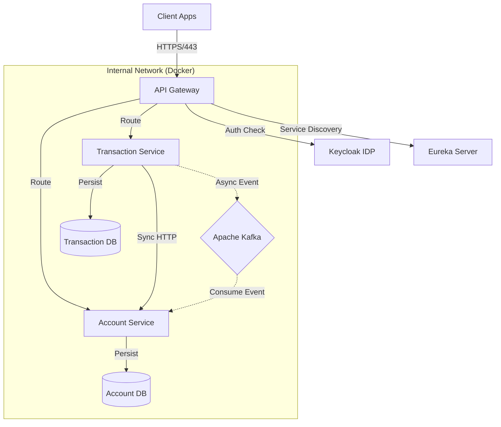

# 🏦 Neo-Bank Core (Secured Microservices Platform)

A production-grade banking ledger system built with **Java 23, Spring Boot 3, and Cloud-Native patterns**. 

This project demonstrates a fully distributed architecture handling high-volume financial transactions with **Zero Trust Security (OAuth2)**, **Eventual Consistency (Kafka)**, and **Resiliency (Circuit Breakers)**.

## 🚀 Architecture Overview

The system implements the **Microservices Pattern** with a centralized API Gateway and Identity Provider.



### Core Components:

1. **API Gateway (Port 8080):** The single entry point. Handles **OAuth2 Resource Server** validation, routing, and load balancing via Eureka.
2. **Identity Provider (Keycloak):** Manages users and issues OIDC/JWT tokens.
3. **Discovery Server (Eureka):** Dynamic service registry for client-side load balancing.
4. **Microservices:**
* **Account Service:** Manages ledger/balances (Optimistic Locking).
* **Transaction Service:** Handles transfer sagas (State Machine).


5. **Infrastructure:** Kafka (Messaging), PostgreSQL (Per-Service DB), Zipkin (Tracing).

## 🛠 Tech Stack

* **Language:** Java 23 (Eclipse Temurin)
* **Framework:** Spring Boot 3.3.0, Spring Cloud (Gateway, Netflix Eureka, OpenFeign)
* **Security:** OAuth2 / OpenID Connect (Keycloak)
* **Messaging:** Apache Kafka (Event-Driven Architecture)
* **Resilience:** Resilience4j (Circuit Breaker)
* **Observability:** Micrometer Tracing + Zipkin
* **Containerization:** Docker & Docker Compose

## 📦 How to Run

### 1. Start the Platform

Run the entire stack (Infrastructure + Apps) with one command:

```bash
docker-compose up -d --build

```

### 2. Configure Keycloak (One-Time Setup)

Since Keycloak starts fresh in Docker, you must configure the Realm:

1. Open **[http://localhost:8180](https://www.google.com/search?q=http://localhost:8180)** (Admin: `admin`/`admin`).
2. Create Realm: `neobank`.
3. Create Client: `neobank-gateway` (Access Type: **Confidential**, Service Accounts: **Enabled**).
4. Create User: `bank-user` (Set password to `password`, uncheck "Temporary").

### 3. Get an Access Token

Act as a frontend client to login and get a JWT:

```bash
export TOKEN=$(curl -s -X POST http://localhost:8180/realms/neobank/protocol/openid-connect/token \
  -H "Content-Type: application/x-www-form-urlencoded" \
  -d "client_id=neobank-gateway" \
  -d "client_secret=<YOUR_CLIENT_SECRET_FROM_KEYCLOAK>" \
  -d "username=bank-user" \
  -d "password=password" \
  -d "grant_type=password" | jq -r '.access_token')

echo "Token: $TOKEN"

```

### 4. Use the API (Via Gateway)

**Note:** Direct access to ports 8081/8082 is blocked. You must use the Gateway (8080) with the Token.

**Create Account (User A):**

```bash
curl -X POST http://localhost:8080/api/accounts \
  -H "Authorization: Bearer $TOKEN" \
  -H "Content-Type: application/json" \
  -d '{"holderName": "User A", "email": "a@bank.com", "initialBalance": 1000}'

```

**Create Account (User B):**

```bash
curl -X POST http://localhost:8080/api/accounts \
  -H "Authorization: Bearer $TOKEN" \
  -H "Content-Type: application/json" \
  -d '{"holderName": "User B", "email": "b@bank.com", "initialBalance": 0}'

```

**Transfer Money:**

```bash
curl -X POST http://localhost:8080/api/transactions \
  -H "Authorization: Bearer $TOKEN" \
  -H "Content-Type: application/json" \
  -d '{"fromAccountId": 1, "toAccountId": 2, "amount": 100}'

```

## ✨ Engineering Highlights

### 🔒 Zero Trust Security

The API Gateway acts as an **OAuth2 Resource Server**. It validates the JWT signature (via JWK Set URI) before forwarding requests. Services never handle authentication logic directly.

### ⚡ Circuit Breaker Pattern

The Transaction Service wraps synchronous calls to the Account Service using **Resilience4j**. If the Account Service is down or slow, the circuit opens immediately (Fast Fail) to prevent resource exhaustion.

### 🔄 Distributed Tracing

Full visibility into the request lifecycle. A Trace ID is injected at the Gateway and propagated through HTTP headers and Kafka metadata.

* **View Traces:** [http://localhost:9411](https://www.google.com/search?q=http://localhost:9411) (Zipkin)

### 📨 Saga Pattern (Choreography)

Distributed data consistency is handled via Kafka events:

1. `TransactionService`: Emits `TransactionInitiated` (State: PENDING).
2. `AccountService`: Consumes event, updates balances, emits `TransactionProcessed`.
3. `TransactionService`: Consumes result, updates state to SUCCESS/FAILED.
