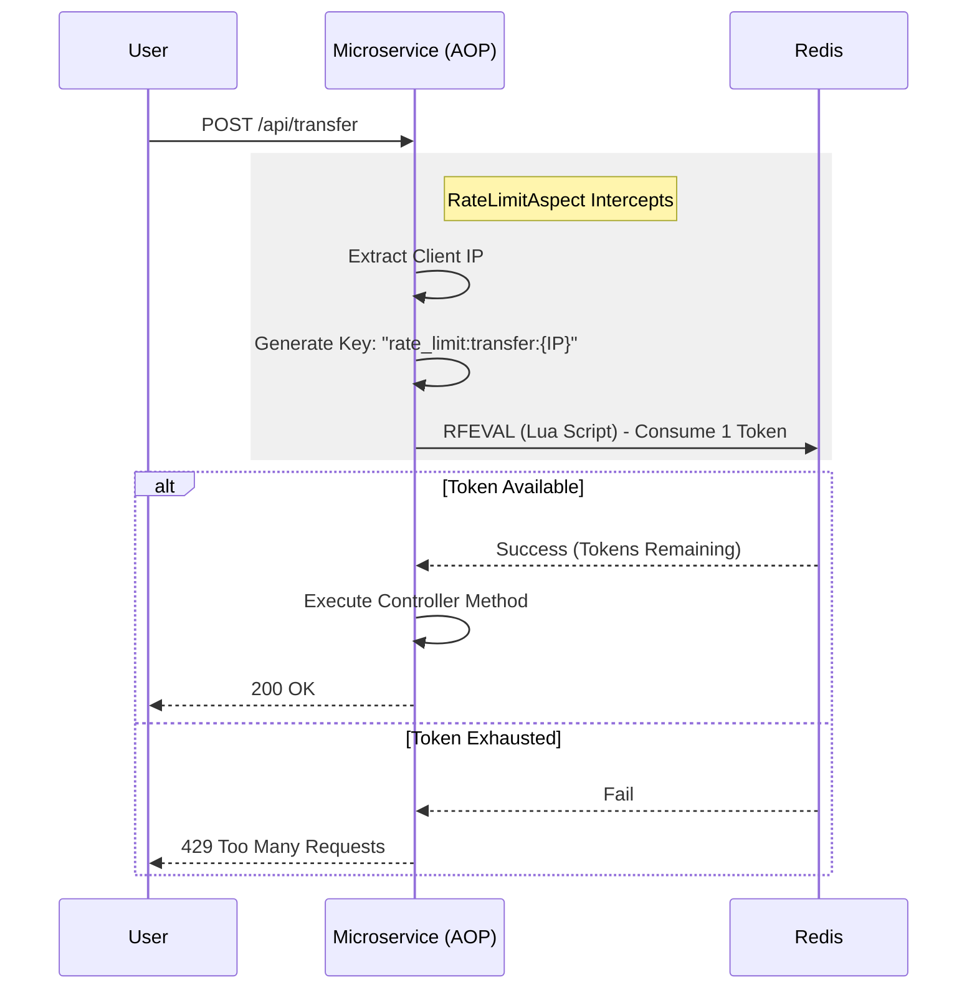

# 🛡️ Distributed Rate Limiter Library

* **Module:** `common-library`
* **Package:** `org.leeminkan.common.ratelimit`
* **Tech Stack:** Bucket4j, Redis (Lettuce), Spring AOP

## 📖 Overview

The Distributed Rate Limiter is a reusable, drop-in component designed to protect our microservices from cascading failures, abuse, and traffic spikes.

Unlike a simple local counter, this library uses **Redis** to maintain state. This means the rate limit is enforced globally across all running instances of a service. If `Service A` scales to 10 replicas, the traffic limit applies to the *cluster*, not just the individual pod.

## ✨ Key Features

* **Declarative:** Apply limits using a single annotation `@RateLimit`.
* **Distributed:** Uses Redis + Lua scripts for atomic token bucket management.
* **Zero-Config for Consumers:** Auto-configured by Spring Boot; simply opt-in via properties.
* **Context Aware:** Limits are applied per **Client IP**, preventing one bad actor from blocking the system for everyone.

## 🚀 How to Use

### 1. Add Dependency
The library is included in `common-library`. Ensure your service depends on it:

```xml
<dependency>
    <groupId>org.leeminkan</groupId>
    <artifactId>common-library</artifactId>
    <version>${project.version}</version>
</dependency>

```

### 2. Enable in Configuration

To keep services lightweight, the rate limiter is **disabled by default**. You must explicitly enable it in your `application.yml`:

```yaml
app:
  rate-limit:
    enabled: true  # <--- Loads the Redis/Bucket4j beans

spring:
  data:
    redis:
      host: redis  # Point to your Redis instance
      port: 6379

```

### 3. Annotate Your Controller

Protect sensitive endpoints by adding `@RateLimit` to the method.

```java
@RestController
@RequestMapping("/api/transactions")
public class TransactionController {

    @PostMapping
    // Result: 1 request allowed every 5 seconds per IP address
    @RateLimit(key = "create_tx", limit = 1, duration = 5) 
    public ResponseEntity<Transaction> create(...) {
        // ... business logic
    }
}

```

## ⚙️ Configuration Reference

The `@RateLimit` annotation supports the following parameters:

| Parameter | Type | Description | Example |
| --- | --- | --- | --- |
| `key` | `String` | **Required.** A unique identifier for the resource being protected. | `"login_api"` |
| `limit` | `long` | **Required.** The max number of requests allowed in the window. | `10` |
| `duration` | `long` | **Required.** The time window length. | `60` |
| `unit` | `TimeUnit` | Time unit for duration (default: `SECONDS`). | `MINUTES` |

## 🏗️ Architecture

How the request flow works under the hood:



## 🔧 Troubleshooting

**Q: I added the annotation but nothing happens.**

* Did you set `app.rate-limit.enabled: true` in `application.yml`?
* Is your Redis container running?

**Q: Why does the Account Service not connect to Redis?**

* The configuration is conditional. Since `account-service` typically does not set the enabled flag, the Redis beans are never loaded, saving resources.
